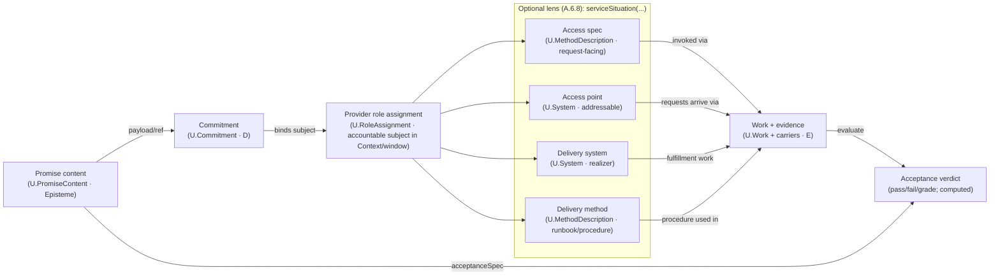

## A.2.3 - `U.PromiseContent` (Promise Content)

### A.2.3:1 - Context

Across domains the word **service** is used for many different things: a server or **provider**, an **API**, a **procedure**, a **run**, a **department**, even a **product bundle**. Such polysemy is productive in everyday speech but toxic in a normative model.

FPF therefore reserves **`U.PromiseContent`** for exactly one kernel meaning: **promise content** — a **promise content** (a consumer‑facing promise statement). Any other “service” sense MUST be modeled explicitly as `U.System`, `U.RoleAssignment`/principal, `U.MethodDescription`, or `U.Work` inside an appropriate `U.BoundedContext` and, in normative prose, MUST be written with an explicit **facet head phrase** per **A.6.8 (RPR‑SERV)**.

This keeps the kernel minimal while keeping the prose readable to non‑mathematicians: the canonical symbol is `U.PromiseContent`, and the head kind in normative text is always *promise content*.

**Modularity note.** A.2.3 defines only the promise‑content object (the **promise content**) and its direct links to roles, access specification, acceptance criteria, and work evidence. The multi‑facet “service situation” bundle that also names provider principals/systems/access points/commitments/acts is handled as a precision‑restoration lens in **A.6.8 (`serviceSituation(…)`)**. Contract‑talk unpacking (and routing of “contract / SLA / guarantee” language) is handled by **A.6.C**, which calls A.6.8 when service‑cluster tokens appear.

In the Role–Method–Work alignment, the **promise content** must say something **external‑facing** and **consumer‑oriented**, yet remain separate from *how* the provider does it (Method/MethodDescription) and *what actually happened* (Work).

> Intuition: the **consumer-facing promise clause** is what you advertise and are judged by (`U.PromiseContent`); **work** is what you do to keep that promise; **method/spec** is how you know what to do. (See A.6.8 for full “service” polysemy unpacking.)
> (Normative head-kind rewrite): a **promise content** is the promise clause you advertise and are judged by; **work** is what you do (and what can be evidenced) to satisfy that promise; **method/spec** is how you know what to do.

**Lexical note (L‑SERV / RPR‑SERV)**

The surface forms *service/service‑level/service use/service access* (and the adjacent cluster *service provider*, *server*) are **ambiguous** across domains. In the kernel, **`U.PromiseContent`** is reserved for promise content only and is written in prose as a **promise content**.

Normative prose therefore SHALL treat the bare head noun **service** as **always‑unpack** (PTG=Guarded): every head‑noun occurrence MUST be rewritten to a facet head phrase (promise content / service provider principal / service access point / service delivery system / …) or to the correct underlying FPF object (team, ticket, endpoint host, procedure, work item), per **A.6.8 (RPR‑SERV)**.

E.10’s lexical anchor **L‑SERV** SHOULD be implemented as “pointer + lint rule” to A.6.8: the short rule names the hazard, while A.6.8 provides the full rewrite recipe and the facet head phrase set.


### A.2.3:2 - Problem

Without a first‑class `U.PromiseContent`, models drift into five recurring errors:

1. **Provider = Service.** Calling the **system** or **team** “the service” collapses structure with promise.
2. **API = Service.** Treating an **interface/endpoint** as the service hides the consumer‑oriented promise (effect + acceptance).
3. **Process = Service.** Mapping a **procedure/Method** (or a WorkPlan) to “service” confuses recipe/schedule with the external commitment.
4. **Run = Service.** Logging **Work** as “a service” erases the Standard/promise layer and breaks SLA reasoning.
5. **Business ontology lock‑in.** Large domain schemes (e.g., “business service” stacks) are imported wholesale, losing FPF’s universality and comparability across contexts.


### A.2.3:3 - Forces

| Force                                       | Tension                                                                                                       |
| ------------------------------------------- | ------------------------------------------------------------------------------------------------------------- |
| **External promise vs internal capability** | Promise content must be consumer‑facing, while capability is provider‑internal.                               |
| **Specification vs execution**              | Promise content is a **specifiable** clause; value is **realised** only by runs of Work.                     |
| **Universality vs domain richness**         | One kernel meaning must cover IT, utilities, healthcare, public services—without absorbing domain taxonomies. |
| **Measurability vs privacy**                | Consumers need SLO/SLA and outcomes; providers want implementation freedom (Method autonomy).                 |
| **Stability vs evolution**                  | Services version and change without invalidating prior Work evidence.                                         |


### A.2.3:4 - Solution — The unified concept `U.PromiseContent`

**Definition (normative).**
Within a `U.BoundedContext`, a **`U.PromiseContent`** is an **externally oriented promise clause**: a context‑local statement of (i) a **promised external effect**, (ii) **eligibility + access** (how a consumer may request/use), and (iii) **acceptance criteria** (SLO/SLA‑like targets) by which fulfillment is judged.

`U.PromiseContent` is **promise content** (`U.Episteme`), not a deontic binding. One or more explicit **`U.Commitment`** objects (A.2.8) MAY reference a `U.PromiseContent` as payload to bind an accountable principal/role‑assignment; the clause itself does not “obligate” anyone until such a commitment is represented.

In normative prose, the head phrase for `U.PromiseContent` is **promise content** (or **service offering clause** / **service promise clause**) per A.6.8; the bare noun *service* is not a valid shorthand for this kernel object.

* **Type:** `U.Episteme` (a promise clause on a carrier).
* **Scope:** design‑time concept; judged at run‑time by evidence from `U.Work`.
* **Time stance:** design-time concept; judged at run-time by evidence from `U.Work`.
* **Orientation:** consumer‑facing (“what you can rely on”), as opposed to capability (“what we can do”).
* **Prose head (normative):** *promise content* (Tech) / *service offering clause* (Plain; *service promise clause* acceptable synonym). (Both twins retain an explicit **clause** head‑kind to avoid act/content ambiguity and to comply with A.6.8 headword governance.)

#### A.2.3:4.1 - Core structure (minimal fields)

```
U.PromiseContent {
  context        : U.BoundedContext,   // where the promise is meaningful
  purpose        : Text/Episteme,      // the externally observable effect/value
  providerRole   : U.Role,             // role kind that may provide it (not a person/system)
  consumerRole?  : U.Role,             // optional role kind allowed to consume
  claimScope?    : U.ClaimScope,       // where the promise holds (G) — operating conditions/populations/locales
  accessSpec?    : U.MethodDescription,       // service access spec: request-facing interface/eligibility; not an access point system
  acceptanceSpec : U.Episteme,         // targets: SLO / acceptance targets (quality/throughput/latency/accuracy…); evaluated over same evidence base as promisedOutcomeSpecRef (CC‑A2.3‑18)
  promisedOutcomeSpecRef : OutcomeSpecRef, // promised outcome (work, result, or both) in disambiguated spec form
  unitOfDelivery?: Episteme,           // how delivered units are counted/measured (unit + countingRule; see A.7:5.10)
  version?       : SemVer/Text,
  timespan?      : Interval
}
```

* `promisedOutcomeSpecRef` MUST point to a `U.OutcomeSpec` (A.7:5.10). It is the promise‑facing outcome template (work‑only / result‑only / composite), not a `U.Work` episode and not an extensional delivered object.
* `providerRole` and `consumerRole` are **role kinds**; the actual performers are **RoleAssignments** at run‑time.
* `acceptanceSpec` defines **what counts as fulfilled** (the test).
* `accessSpec` is **how to ask** (eligibility, protocol, counter, desk, API).
* **Internal delivery methods/runbooks are not part of the promise content.** Model them as `U.MethodDescription` and relate them to the clause via `serviceSituation(…)` (A.6.8) or explicit context relations; providers retain **Method autonomy**.

#### A.2.3:4.1.1 - Promised outcome spec (disambiguation: work vs post-work result)

`promisedOutcomeSpecRef` points to an `U.OutcomeSpec` episteme that makes explicit **what exactly is promised** — in *kind/spec* form — without collapsing it into either:

* the **promise content clause** itself (`U.PromiseContent`),
* the **delivery work** that happens at run‑time (`U.Work`), or
* the **resulting state/object** after the work.

This is a controlled **semantic precision restoration** for the everyday metonymy “outcome/service outcome”, which different communities use to mean (i) the work performed, (ii) the achieved result, or (iii) both.

**Terminology bridge (informative).**
In loose contract talk people say **promiseOutcomeSpec** (the description of what will be delivered) and **promiseOutcome** (what was actually delivered). Those surface forms are metonymic: sometimes they mean “the work performed”, sometimes “the post‑work result”, and sometimes the pair.

In FPF:

* **promiseOutcomeSpec** → `U.OutcomeSpec` (A.7:5.10), referenced via `promisedOutcomeSpecRef`.
* **promiseOutcome** → an **extensional delivered outcome instance**. It is not a single kernel object; it is the **run‑time reality** that satisfies the outcome spec, understood according to `U.OutcomeSpec.mode`:

  * `WorkOnly` → the **set of delivery `U.Work` episode(s)** that satisfy `workSpec` (and, if present, the promised `methodConstraintRef`).
  * `ResultOnly` → the **post‑work state of the described referent(s)** on the declared `statePlaneRef` that satisfies `resultSpec.postConditionRef` (regardless of how it was achieved).
  * `Composite` → the pair: **(delivery Work episode(s), post‑work state)**.

  FPF points to this extensional delivered outcome instance by citing: (i) the relevant `U.Work` occurrence(s) and (ii) their **Δ anchors** (affected referents + pre/post anchors) on the declared state‑plane (A.15.1:4.2 item 10). Evidence carriers/telemetry are **epistemic witnesses** used to justify those anchors and acceptance verdicts—they are not themselves the delivered outcome.

If a Context needs an explicit handle for the delivered instance (e.g., for bundling, invoicing, or dispute cases), it MAY introduce a local kind such as `OutcomeInstance` with separate slots for: `{workRefs, affectedEntityRefs, postStateAnchors, evidenceRefs}`. Such a local reification MUST keep **(a) the extensional delivered instance**, **(b) the evidence about it**, and **(c) the outcome spec** (`U.OutcomeSpec`) distinct.

A conforming `U.OutcomeSpec` uses the canonical shape from A.7:5.10.2:

```
U.OutcomeSpec ::= {
  mode: WorkOnly | ResultOnly | Composite,

  workSpec?: {
    methodConstraintRef?: MethodDescriptionRef,   // optional: method is part of the promise (not “implementation detail”)
    workPredicateRef: EpistemeRef                 // predicate on `U.Work` facts/evidence
  },

  resultSpec?: {
    describedEntityRef?: EntityRef,               // what thing’s post‑state matters (may be kind‑labelled)
    statePlaneRef?: StatePlaneRef,                // where the predicate lives (A.7:3 pins)
    postConditionRef: EpistemeRef                 // predicate on post‑state (or evidence about it)
  }
}
```

* `workSpec` corresponds to the **work‑as‑promised** facet: it states the consumer‑facing *kind* of work (optionally constraining method) and the work predicate (e.g., duration, method ban, safety bound).
* `resultSpec` corresponds to the **result‑as‑promised** facet: it states the post‑work entity/state kind and the postcondition predicate.
* **Counting is not part of `U.OutcomeSpec`.** Counting lives on `U.PromiseContent.unitOfDelivery` as the `countingRule` mini‑schema (A.7:5.10.3). Outcome specs say *what* counts as delivery; unit‑of‑delivery specs say *how much* to count and how to avoid double counting.

**Examples (informative):**

* “Work 5 minutes” → `mode=WorkOnly`; `workPredicateRef` states duration ≥ 5 min; `methodConstraintRef` may be omitted.
* “Dig a hole” → `mode=ResultOnly`; `postConditionRef` describes the hole’s target state; method choice remains provider‑autonomous.
* “Hairstyle in ≤ 20 min, must be haircut+styling (not a wig)” → `mode=Composite`; `workSpec` expresses time + method constraint; `resultSpec` expresses the target hairstyle state.

**Naming note (normative).**
The head noun **outcome** is intentionally broad. Do **not** replace it with **result** when referring to the combined promise payload. If a passage means the **post‑work entity/state only**, say **result** and bind it to `resultSpec`. If it means the **work episode(s) promised**, say **work as promised** and bind it to `workSpec`.

#### A.2.3:4.1.2 - Recommended `acceptanceSpec` mini‑schema *(informative, non‑kernel)*

`acceptanceSpec : U.Episteme` is intentionally open‑ended in Core. However, to keep acceptance **computable** (and to avoid the legacy “pass verdict separate from delivery” mistake), Contexts are encouraged to express `acceptanceSpec` as a small bundle of references:

```
AcceptanceSpec (recommended) ::= {
  targetOutcomeSpecRef?: OutcomeSpecRef,  // default: SC.promisedOutcomeSpecRef
  criteriaRefs: [EpistemeRef],            // each criterion evaluates the *delivery evidence base* (U.Work facts + Δ anchors + admissible Observations)
  verdictScale: Episteme/ScaleRef,        // pass/fail/graded; MUST state how “non‑delivery” is represented
  Γ_timePolicyRef?: EpistemeRef           // how Γ_time is selected (per‑Work, per calendar window, per batch, per population, …)
}
```

* **`targetOutcomeSpecRef`** makes explicit *which* promised outcome is being judged; if omitted, it is the containing promise content’s `promisedOutcomeSpecRef`.
* **`criteriaRefs`** are the acceptance criteria (SLO targets, quality gates, compliance predicates, etc.). Each criterion is an evaluation over the **same evidence base** used to establish delivery of the targeted `U.OutcomeSpec`: `U.Work` facts/evidence plus the relevant **Δ anchors** (affected referents + pre/post anchors) on the declared state‑plane, and any admissible `U.Observation` witnesses.
* **`verdictScale`** declares the decision scale (boolean, trichotomy, graded). It MUST define what happens when the outcome is **not delivered** (e.g., `fail`, `N/A`, `Inconclusive`, or a dedicated grade).
* **`Γ_timePolicyRef`** keeps windowing explicit and non‑retroactive (F.10/F.12): it states whether judgement is per Work episode, per reporting window, per population, etc.

This mini‑schema is a **recommendation only**: it is not a kernel object and may be flattened, encoded in a canonical SLO vocabulary, or carried in local contract artefacts. Its purpose is to keep acceptance **discussable, auditable, and bridge‑ready**.

#### A.2.3:4.2 - What `U.PromiseContent` is **not**

* **Not a provider:** use `System#ServiceProviderRole:Context` `U.RoleAssignment`.
* **Not a deontic commitment:** that is `U.Commitment` (A.2.8) referencing the promise content as payload.
* **Not an access point:** addressable “services/servers/desks/endpoints” are `U.System` (see A.6.8: *service access point* / *service delivery system*).
* **Not a method/recipe:** that is `U.Method/MethodDescription`.
* **Not a run/incident/ticket:** that is `U.Work`.
* **Not a schedule:** that is `U.WorkPlan`.
* **Not a capability:** capability is **provider‑intrinsic ability**; service is **outward promise**. A service may **require** certain capabilities, but it **is not** the capability.
* **Not a scope label:** do **not** use *applicability*, *envelope*, *generality*, or *validity* as **scope characteristics**; declare **Claim scope (G)** or **Work scope** explicitly where needed (A.2.6).

#### A.2.3:4.3 - Position in the enactment chain

* **Design‑time:**
  The context **declares Claim scope (G)** for acceptance (operating conditions, populations, locales) per A.2.6.
  The context may assert: `bindsCapability(ServiceProviderRole, Capability)`.
  Providers choose `Method/MethodDescription` to realise the promised effect described by the promise content.

* **Run‑time:**
  A **consumer** performs `Work` (e.g., a request/visit) — `performedBy: ConsumerRoleAssigning`.
  The **provider** performs `Work` to fulfil the promise content — `performedBy: ProviderRoleAssigning`.
  Delivered `Work` instances are evaluated against `acceptanceSpec`, **linked** to `promisedOutcomeSpecRef`, and **counted** via `unitOfDelivery`.
  SLA/SLO outcomes are therefore functions over **Work evidence**, not over the promise content object itself.
 
  (Terminology note: use `…RoleAssignment` consistently for the run‑time enactor relation; avoid the “RoleAssigning” variant unless it is a separately defined kind in the Context.)

> **Memory hook:** *Promise content promises, Method describes, Work proves.*

#### A.2.3:4.4 - Didactic card: The service delivery chain (clause → commitment → situation → work → acceptance)

> **Didactic (non‑normative).** This is a one‑screen “map” that stitches the modular pieces together:
> `U.PromiseContent` (A.2.3) → `U.Commitment` (A.2.8) → provider `U.RoleAssignment` (A.2.1) → *serviceSituation(...)* facet slots (A.6.8 lens) → `U.Work + carriers` (A.15) → acceptance verdict (A.2.3).
>  
> This is **not new ontology**. It is a reader‑safety diagram that prevents two common category errors:
> (i) treating `U.PromiseContent` as something addressable (“the service you call”), and
> (ii) treating `serviceSituation(...)` as semantics rather than a *binding lens* over already‑defined kinds.



**Reading guide (one breath).**
* The **promise content** is *what is promised* (promise content).
* The **commitment** is *who is bound* (deontic accountability) and it **references** the clause.
* The **provider role assignment** is the accountable subject *that can act* in a given Context/window.
* `serviceSituation(...)` (A.6.8) is a **facet‑binding lens** that names the common “service talk” participants (access spec / access point / delivery system / delivery method) **without** collapsing them into the clause.
* **Work + evidence** is what happened; the **acceptance verdict** is computed by applying the clause’s `acceptanceSpec` to work evidence (not by reading the clause, and not by “looking at the service” as a system).

**Litmus rule (addressability).**
If you can *call / connect to / visit / restart / scale* it, you are talking about a **service access point** (system facet), not the **promise content** (promise content).


### A.2.3:5 - Archetypal grounding (engineer‑manager friendly)

| Domain                    | **`U.PromiseContent` (promise)**                           | Provider & Consumer (as Roles)                                   | Access (how to ask)                  | Fulfilment (Work)                        | Typical acceptance targets                  |
| ------------------------- | --------------------------------------------------------- | ---------------------------------------------------------------- | ------------------------------------ | ---------------------------------------- | ------------------------------------------- |
| **Cloud/IT**              | “**Object Storage**: durable PUT/GET of blobs up to 5 TB” | `CloudTeam#ServiceProviderRole`, `BackupJob#ServiceConsumerRole` | `S3_API_Spec_vX` (`MethodDescription`)      | Each PUT/GET run; data durability checks | Availability ≥ 99.9%, durability 11×9       |
| **Manufacturing Utility** | “**Compressed air** at 8 bar in Zone B”                   | `Maintenance#Provider`, `LineB#Consumer`                         | Manifold access rules (`AccessSpec`) | Compressor cycles & delivery logs        | Pressure window, purity class, flow ceiling |
| **Public Service**        | “**Passport issuance** within 20 days”                    | `Agency#Issuer`, `Citizen#Applicant`                             | Portal/desk SOP (`AccessSpec`)       | Case handling runs                       | Lead time ≤ 20 days, defect ≤ 1%            |

**Key takeaway:** the **same kernel object** models S3, a plant utility, and a government service: a **promise with access and acceptance**. Everything else (APIs, compressors, clerks, workflows, tickets) is mapped via **Role/Method/Work**.


### A.2.3:6 - Mapping the common “service” picture to FPF (didactic bridge)

The popular service diagrams (provider ↔ access ↔ use ↔ capability/activity) map to FPF as follows:

* **Agent (as Service Provider)** → `System#ServiceProviderRole:Context` (`U.RoleAssignment`).
* **Service Level Objective (SLO)** / acceptance targets → `U.PromiseContent.acceptanceSpec` (+ optional `WorkPlan` for windows).
* **Service Level Agreement (SLA)** (binding obligation) → `U.Commitment` referencing the relevant `U.PromiseContent` (and, where needed, its acceptance/evidence specs); use **A.6.C Contract Bundle** when packaging “the SLA” as an artefact set.
* **SLA document / published terms** → `U.SpeechAct` (promise/offer act) + the clause carrier (`U.Episteme`), per A.2.9 + A.7.
* **Operating conditions / “where the promise holds”** → `claimScope : U.ClaimScope (G)` (or embedded in `acceptanceSpec`) per A.2.6.
* **Subject of service (“customer material”: asset/data/person/case whose state is changed)** → `promisedOutcomeSpecRef.resultSpec.describedEntityRef` (and the affected referents in delivery `U.Work.Δ`). “Ours vs theirs” (ownership/custody) is modeled as a **role/relationship inside the Context** (e.g., `OwnerRole:…`, `CustomerRole:…`, operated‑by/owned‑by), not as a Kernel‑global property.

* **Service Presence / Access** → `accessSpec : MethodDescription` (interface/eligibility); actual endpoints are **systems** playing interface roles.
* **Individual Service Use** → **consumer and provider `U.Work`** instances linked to the `U.PromiseContent` they fulfil.
* **Service‑Enabled Capability / Activity** → effects on the consumer side: either a **Capability** gained/used, or **Work** performed; do **not** reify as a new kernel type.

(Where a domain needs richer structures—catalogs, exposure layers, charging, entitlement—model them **in the domain context** and relate them to `U.PromiseContent` via `U.RoleAssignment` and alignment bridges.)

### A.2.3:7 - Conformance Checklist (normative)

**CC‑A2.3‑0 (Prose head phrase).**
In normative prose, an instance of `U.PromiseContent` SHALL be referred to as a **promise content** (or **service offering clause** / **service promise clause**) and SHALL NOT be referenced by the bare head noun *service*. Unqualified *service* usage (and the co‑moving cluster *service provider* / *server*) SHALL be unpacked per A.6.8 (RPR‑SERV).

**CC‑A2.3‑1 (Type).**
`U.PromiseContent` **IS** an `U.Episteme` (a consumer‑facing **promise content** on a carrier). It is **not** a `U.System`, **not** a `U.Method/MethodDescription`, **not** a `U.Work`, and **not** a `U.WorkPlan`.

**CC‑A2.3‑2 (Context).**
Every **promise content** **MUST** be declared **inside** a `U.BoundedContext`. Names and meaning are **local**; cross‑context reuse requires a Bridge (`U.Alignment`).

**CC‑A2.3‑3 (Role kinds, not people/systems).**
`providerRole` and (if used) `consumerRole` **MUST** be **role kinds** (see A.2). Actual performers at run‑time are `U.RoleAssignment`s.

**CC-A2.3-4 (Acceptance).**
`acceptanceSpec` **MUST** be present and **MUST** define how delivered `U.Work` is judged (pass/fail/graded) against declared targets (SLO‑style; any SLA deontics bind via `U.Commitment`), and **MUST** declare **Claim scope (G)** where relevant (operating conditions, populations, locales). Every verdict binds to an explicit **Γ_time** window.
If the acceptance criteria mention measurable characteristics (availability, latency, accuracy, cost, safety, …), each such characteristic MUST be introduced via the Characterization patterns (C.16 / C.25): an explicit `U.Characteristic` (with scale/unit and measurement procedure / evidence carrier), referenced by id rather than only by a bare KPI name.

**CC‑A2.3‑5 (Access).**
If consumers must request/obtain **service delivery work** through a request‑facing interface, `accessSpec` **MUST** reference the MethodDescription that defines eligibility and invocation rules (API/desk/SOP). If the **service access point** is ambient (e.g., compressed air on a manifold), `accessSpec` **MAY** be omitted, but the eligibility condition **MUST** be stated in the Context.

**CC‑A2.3‑6 (Unit of delivery + counting rule).**
If performance is counted/charged, `unitOfDelivery` **SHOULD** be declared (e.g., “request”, “kWh”, “case”).
When declared, `unitOfDelivery` **MUST** include a **countingRule** that maps accepted delivery work episodes (`W✓`) to unit counts (A.7:5.10). If omitted, the default is “1 unit per accepted delivery work episode”.

**CC‑A2.3‑7 (No actuals on Promise Content).**
Resource/time **actuals** and incident logs **MUST** attach to `U.Work` only (A.15.1). Promise contents carry no actuals.

**CC‑A2.3‑8 (Capability requirement).**
If the context requires provider abilities, it **MUST** express them as `bindsCapability(providerRole, Capability)` in the context, not by stuffing capabilities into the Service object.

**CC‑A2.3‑9 (Versioning & timespan).**
Promise contents **MAY** carry `version`/`timespan`. A `U.Work` that claims/fulfils a promise content **MUST** record which service‑clause version it used.

**CC‑A2.3‑10 (Lexical rule).**
Unqualified head‑noun uses of *service* (and the co‑moving cluster *service provider* / *server*) in normative prose **MUST** be disambiguated per **A.6.8 (RPR‑SERV)** and its lexical anchor **L‑SERV** (E.10). 

**CC‑A2.3‑11 (No mereology).**
Do **not** place a promise content clause in PBS/SBS or treat it as a part/component. Structural assemblies live in PBS/SBS; the promise clause is an episteme (A.2.3) and “service” talk must be facet‑unpacked (A.6.8).

**CC‑A2.3‑12 (Plan–run split).**
Windows and calendars belong to `U.WorkPlan` (A.15.2). Fulfilment evidence belongs to `U.Work` (A.15.1).

**CC-A2.3-13 (Scope lexicon & guards).**
Deprecated labels *applicability/envelope/generality/validity* **MUST NOT** appear as scope characteristics in guards or conformance blocks. Use **`U.ClaimScope (G)`** for epistemes and **`U.WorkScope`** for capabilities (A.2.6/A.2.2). Scope-sensitive guards **MUST** use **ScopeCoverage** with explicit **Γ_time** selectors.

**CC-A2.3-14 (Bridges & CL).**
Cross-context mappings via Bridges keep **F/G** stable; **CL** penalties apply to **R**. A mapping **MAY** recommend **narrowing** the mapped **Claim scope (G)** as best practice (A.2.6/B-line).


**CC-A2.3-15 (OutcomeSpec typing).**
`promisedOutcomeSpecRef` MUST resolve to `U.OutcomeSpec` (A.7:5.10). It MUST NOT be used to point at a concrete `U.Work` episode or at an extensional delivered object.

**CC-A2.3-16 (OutcomeSpec is explicit and mode‑complete).**
`promisedOutcomeSpecRef` MUST be present and MUST reference an `U.OutcomeSpec` that declares `mode ∈ {WorkOnly, ResultOnly, Composite}` and satisfies A.7:5.10 mode completeness:
* `WorkOnly` → `workSpec` present, `resultSpec` absent
* `ResultOnly` → `resultSpec` present, `workSpec` absent
* `Composite` → both `workSpec` and `resultSpec` present

**CC-A2.3-17 (OutcomeSpec ⇄ Work anchoring).**
For any `U.Work` that `claimsPromiseContent(-, SC)` (and especially for `fulfilsPromiseContent(-, SC)`), the Context MUST be able to derive an evidence link from that Work to `SC.promisedOutcomeSpecRef`:
* if `SC.promisedOutcomeSpecRef.workSpec` is present, the Work is compatible with `methodConstraintRef` (if present) and satisfies `workPredicateRef`;
* if `SC.promisedOutcomeSpecRef.resultSpec` is present, the Work’s outputs / affected referents / effect‑delta (and cited evidence carriers) satisfy `postConditionRef` on the referenced `statePlaneRef` (or its declared default plane).
(You MAY materialize this as `deliversPromisedOutcome(Work, OutcomeSpec)` per A.2.3:8.1 for auditability.)

**CC-A2.3-18 (AcceptanceSpec ⇄ OutcomeSpec binding).**
`acceptanceSpec` MUST be written as an evaluation over the same evidence base used to establish delivery of `SC.promisedOutcomeSpecRef`. In particular, a Work MUST NOT be judged “pass” for a promise content unless it also delivers the promised outcome spec (see `fulfilsPromiseContent` in A.2.3:8.1). If the Context uses multi‑grade verdicts, it MUST declare how “non‑delivery” is represented (fail, N/A, separate grade).

**CC-A2.3-19 (OutcomeSpec ↔ unitOfDelivery coherence).**
If `unitOfDelivery` is present, its `countingRule.selectorRef` MUST select only Work episodes that are eligible to satisfy `SC.promisedOutcomeSpecRef` (WorkOnly / ResultOnly / Composite) and MUST define how to avoid double counting (via an explicit `dedupeKeyRef` or a policy cited by id) when a single Work episode can satisfy multiple clauses/bundles. The selector MAY be “all fulfilments” (`fulfilsPromiseContent`) but MUST NOT count non‑delivering Work episodes.

**CC-A2.3-20 (Unit-of-delivery is computable from Work evidence).**
If `unitOfDelivery` is present, then it MUST declare how delivered units are computed from Work evidence (duration, quantity, cases, kWh, etc) per A.7:5.10.3. The default “1 unit per fulfilment Work” is permitted only when `unitOfDelivery` is a pure count of fulfilment episodes.

### A.2.3:8 - Evidence relations & operators (Promise content ⇄ Work)

To keep the promise → evidence path explicit:

#### A.2.3:8.1 - Core relations

* **`claimsPromiseContent(Work, PromiseContent)`** — the Work instance **intends** to fulfil the promise content (pre‑verdict).
* **`deliversPromisedOutcome(Work, OutcomeSpec)`** — the Work instance evidences delivery of the promised outcome spec (work facet and/or result facet); derived from Work’s I/O/Δ plus the `U.OutcomeSpec` (and MAY be asserted explicitly for auditability).
* **`acceptanceVerdict(Work, PromiseContent)`** → {`pass`, `fail`, `partial`, context‑specific grades} — computed by applying `acceptanceSpec` (with its declared **Γ_time** and claim scope) to the same Work facts/evidence used to establish delivery.
* **`fulfilsPromiseContent(Work, PromiseContent)`** — the Work instance both (i) **delivers** the promised outcome spec and (ii) **passes** the promise content’s `acceptanceSpec`.
* **`usesAccess(Work, MethodDescription)`** — consumer Work that invokes the service via its `accessSpec` (when applicable).

> **Invariant:** `fulfilsPromiseContent(W,SC)` ⇒ `claimsPromiseContent(W,SC)` and `deliversPromisedOutcome(W, SC.promisedOutcomeSpecRef)` and `acceptanceVerdict(W,SC)=pass`.
> **Invariant:** A Work can claim/fulfil **multiple** promise contents only if the context declares a counting policy (no silent double‑counting).

#### A.2.3:8.2 - Service‑clause performance operators

Let `W(SC, T)` be the set of Work that `claimsPromiseContent(-,SC)` within time window `T`. Let `W✓(SC, T)` be those with `fulfilsPromiseContent`.

* **Delivered units:** `delivered(SC, T)` is computed from the set `W✓(SC, T)` using `unitOfDelivery`’s **countingRule** (A.7:5.10). Default (when `unitOfDelivery` is absent): `delivered(SC, T) = |W✓(SC, T)|` (one unit per accepted delivery work).
* **Rejection rate:** `rejectRate(SC, T) = 1 − |W✓(SC,T)| / |W(SC,T)|` (declare handling of `partial`).
* **Lead time:** average/percentile of `duration(Work)` or of request→completion delta (declare definition).
* **Availability/Uptime:** computed from Work/telemetry events per the context’s definition (declare availability source).
* **Cost‑to‑serve:** sum of `Γ_work` over `W✓` per resource category (A.15.1).

All metrics are **functions of Work evidence**; the promise content object is never the bearer of actuals.
Aggregation across time uses `Γ_time` policies (union vs convex hull) chosen by the KPI owner.

### A.2.3:9 - Anti‑patterns (and the right move)

* **“The microservice **is** the service.”**
  Rewrite to facet‑explicit terms (A.6.8): the microservice is typically a **service delivery system** (`U.System`) and/or a **service access point** (`U.System`). Keep the **promise content** as a **promise content** in `U.PromiseContent`, and bind accountability via `U.Commitment` if needed.

* **“The API **is** the service.”**
  The API is typically a **service access spec** (`accessSpec : MethodDescription`) (and systems playing interface roles). The **promise content** is the promise content judged by `acceptanceSpec`.

* **“Our **process** is the service.”**
  Process/recipe is `U.Method/MethodDescription`; schedule is `U.WorkPlan`. The **promise content** is **what is promised to the consumer**.

* **“The **ticket** is the service.”**
  A ticket/case is `U.Work` (and perhaps a `WorkPlan` item). Evidence and outcomes sit on Work, not on the promise content.

* **“Attach cost to the service.”**
  Actual cost/time attach to `U.Work` only (A.15.1). Service metrics are computed **from** Work.

* **“Put service under BoM.”**
  Services are not structural parts. Keep PBS/SBS clean.

* **“Hard‑code people into the service.”**
  Name **role kinds** in the promise content (`U.PromiseContent`); run‑time performers are `U.RoleAssignment`s.


### A.2.3:10 - Migration notes (quick wins)

1. **Name the promises.** List 5–15 consumer‑facing promises your context lives by; reify each as `U.PromiseContent` with `acceptanceSpec` and, if needed, `accessSpec` and `unitOfDelivery`.
2. **Separate provider from promise content.** Keep systems/teams as `U.System`; make them providers via `…#ServiceProviderRole:Context`.
3. **Wire evidence.** Ensure every relevant `U.Work` has `claimsPromiseContent` (and `fulfilsPromiseContent` post‑verdict).
4. **Choose metrics.** For each Service/promise content, define 2–4 KPIs and the **exact** Work-based formulas (availability, lead-time, rejection rate, cost-to-serve), declare the **Claim scope (G)** and **Γ_time** policy used for each KPI, and—when KPIs are numeric/comparable—define the underlying `U.Characteristic` + measurement procedure/evidence (C.16/C.25) and pin `{UnitType, ScaleKind, ReferencePlane, EditionId}`.
   → For each **promise content**, define 2–4 KPIs and the exact Work-based formulas, with explicit `Γ_time`.
5. **Bridge domains.** If a business ontology already exists (“business/technical/internal service”), keep it in its own context and map to FPF Kinds via Bridges.
6. **Tidy language.** Apply **A.6.8 (RPR‑SERV)** / **L‑SERV**: ban unqualified “service” as a synonym for server/team/process/ticket in normative prose; map them explicitly.


### A.2.3:11 - Relations

* **Builds on:** A.1.1 `U.BoundedContext`; A.2 `U.Role`; A.2.1 `U.RoleAssignment`; A.2.2 `U.Capability`; **A.2.6 `U.Scope` / `U.ClaimScope (G)` / `U.WorkScope`**.
* **Coordinates with:** A.3.1 `U.Method`; A.3.2 `U.MethodDescription`; A.15.1 `U.Work`; A.15.2 `U.WorkPlan`; **A.6.8 (RPR‑SERV)** for normative prose unpacking of the service cluster; **B-line Bridges & CL (CL→R; may recommend ΔG narrowing)**.
* **Constrained by lexical rules:** **E.10 L‑SERV** (service disambiguation); also **L‑FUNC**, **L‑PROC**, **L‑SCHED**, **L‑ACT**.
* **Informs:** Reporting/assurance patterns (service KPIs, SLA dashboards); catalog/exposure patterns in domain contexts.


### A.2.3:12 - Didactic quick cards (engineer‑manager ready)

* **Promise content = Promise content.** *What we advertise and are judged by.*
* **Method/Spec = Recipe.** *How we usually do it (provider‑internal).*
* **Work = Evidence.** *What actually happened and consumed resources.*
* **Provider/Consumer = Roles.** *assignment via RoleAssigning at run‑time.*
* **Metrics from Work.** *Uptime, lead time, quality are computed from Work, not from the Service object.*
* **Keep PBS/SBS clean.** *Services are not parts; they are promises.*
  
### A.2.3:End
